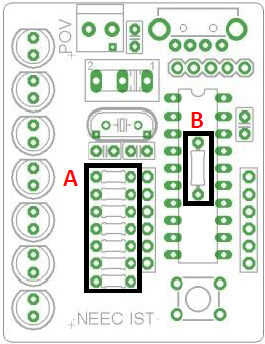
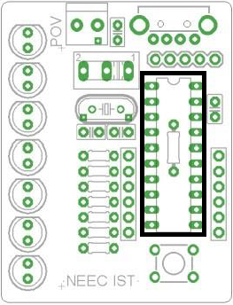
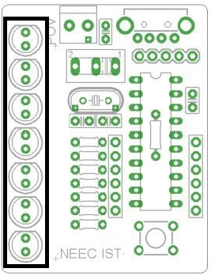
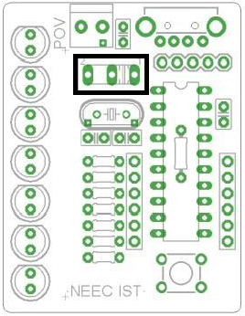

# POV

# Material list

| Components | Quantity | Image |
| -----------|----------|-------|
| PCB POV | 1 | ![Something] |
| Resistência 100Ohm 1/8W | 7 |  |
| Resistência 10kOhm 1/8W | 1 |  |
| Cristal 12MHz | 1 | ![Something] |
| Socket 20 pinos | 1 | ![Something] |
| Condensador 100nF | 1 | ![Something] |
| Condensador 220nF | 1 | ![Something] |
| Condensador 22pF | 2 | ![Something] |
| LED (vermelho, laranja...) | 7 | ![Something] |
| Interruptor ON/OFF | 1 | ![Something] |
| Botão Reset | 1 | ![Something] |
| Conector USB-A macho | 1 | ![Something] |
| Suporte 2 pilhas AA/AAA | 1 | ![Something] |
| PIC 18F14K50 programado | 1 | ![Something] |

# Guia de Montagem

1. Soldar o conector USB.
**NOTA:** Exagerar na solda para que fique bem preso.

2. Soldar as resistências:
A: (7x) 100 Ω (Castanho, Preto, Castanho, Dourado)
B: (1x) 10 kΩ (Castanho, Preto, Laranja, Dourado).

3. Soldar o oscilador de cristal de 12MHz.
**NOTA:** a posição em que é montado não é relevante.

4. Soldar o socket do PIC.
**NOTA:** soldar o suporte do Circuito Integrado; a montagem do PIC é feita só no final.

5. Soldar os condensadores:
A – (1 x) 100nF
B – (1 x) 220nF
C – (2 x) 22pF
**NOTA:** Não importa a ordem de montagem, visto que se tratam de condensadores de cerâmica.

6. Soldar os 7 LEDs.
**NOTA:** o cátodo – pata mais curta de cada LED – fica do lado achatado dos desenhos na placa.

7. Soldar o interruptor ON/OFF.
**NOTA:** se necessário, separar mais as patas do interruptor para se ajustarem aos buracos na placa.

8. Soldar o botão que servirá de reset.

9. Prender os fios do socket de pilhas AAA nos buracos de alimentação da placa.
**NOTA:** ligar o fio vermelho ao lado positivo.

10. Soldar os fios do socket de pilhas AAA.
